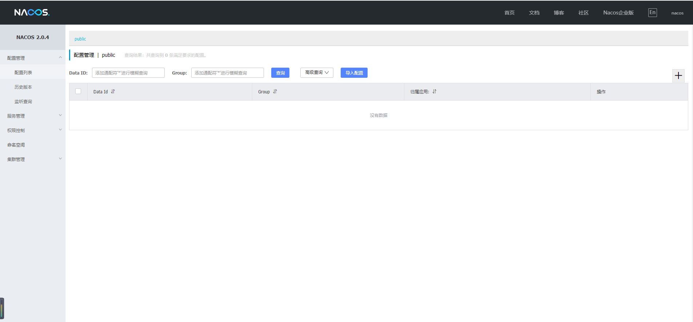

# Nacos搭建
## 使用Docker
```shell
# 下载nacos镜像
docker pull nacos/nacos-server
# 运行naocs镜像
docker run --name nacos-server -e MODE=standalone -p 9090:8848 -d -v /home/resources:/home/resources nacos/nacos-server

# 查看运行中的镜像
docker ps -a
```
## 访问地址
http://192.168.237.132:9090/nacos/
## 默认用户名
nacos nacos
## 界面

