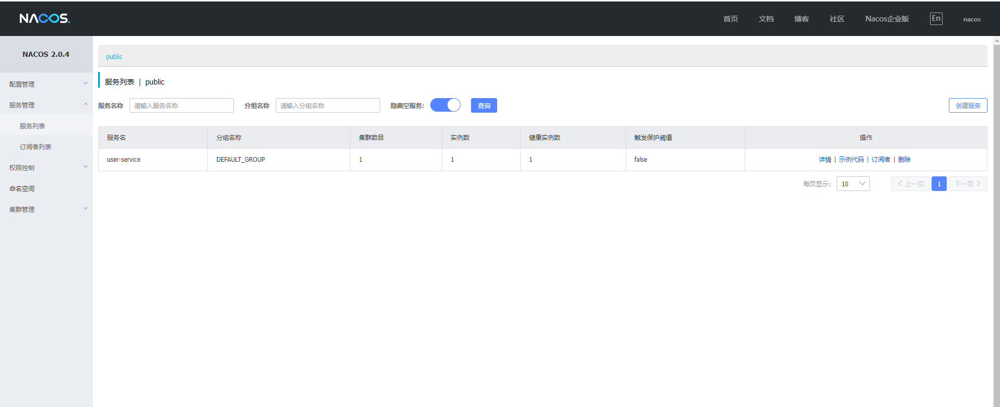

# 服务注册
## 引用nacos客户端依赖
```xml
<dependencies>
    <!-- nacos客户端依赖包 -->
    <dependency>
        <groupId>com.alibaba.cloud</groupId>
        <artifactId>spring-cloud-starter-alibaba-nacos-discovery</artifactId>
    </dependency>
</dependencies>
```
## 修改配置文件，添加nacos服务端地址
```yaml
server:
    port: 8090
    servlet:
        context-path: /user
spring:
    cloud:
        nacos:
            # nacos 服务注册地址
            server-addr: 192.168.237.132:9090
    application:
        # 服务的名字
        name: user-service
```
## 效果图
